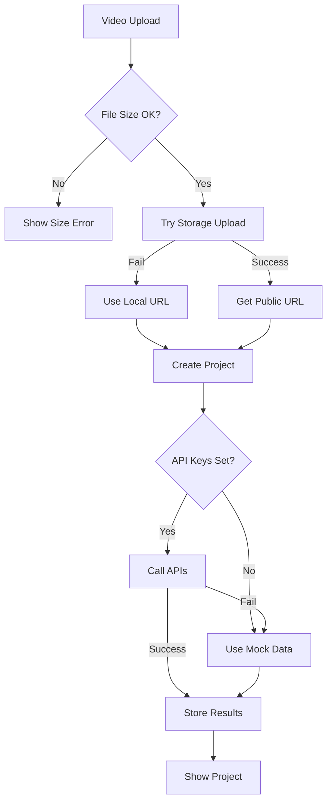

# Video Upload Fix & Klap API Integration

## Overview

This document describes the fixes implemented for video upload errors and the integration with Klap API for automatic transcription.

## Common Errors and Solutions

### 1. **OpenAI API Key Error**
```
Error: The OPENAI_API_KEY environment variable is missing or empty
```

**Solution**: 
- The transcription service has been updated to not require OpenAI on the client side
- API calls now use server-side endpoints with mock data as fallback
- To use real transcription, add `OPENAI_API_KEY` to your `.env.local` (optional)

### 2. **File Size Exceeded Error**
```
Error: The object exceeded the maximum allowed size
```

**Solution**:
- Supabase free tier has a 50MB file limit by default
- Go to Supabase Dashboard → Settings → Storage
- Increase "Global file upload limit" (requires Pro plan for >50MB)
- The app now shows helpful error messages with file size info

### 3. **Storage Bucket Not Found**
```
Error: Storage bucket "videos" not found
```

**Solution**:
1. Go to Supabase Dashboard → Storage
2. Create a new bucket named `videos`
3. Set it as **Public**
4. Apply the RLS policies from the setup guide

### 4. **CORS/Fetch Errors with Klap API**
```
TypeError: Failed to fetch
```

**Solution**:
- Klap API calls are now made server-side to avoid CORS
- The app uses mock data when API is unavailable
- Check if browser extensions are blocking requests

### 5. **Failed to Process Clips/Transcription**
```
Error: Failed to transcribe video
Error: Failed to process clips with Klap
```

**Solution**:
- These now fall back to mock data automatically
- Check your API keys in `.env.local`
- Verify your Klap API access is active

## Changes Made

### 1. **Client-Side Fixes**
- Removed OpenAI initialization from client code
- Added better error handling with user-friendly messages
- Implemented fallback strategies for all API failures

### 2. **Server-Side API Endpoints**
- Created `/api/process-transcription` - Handles transcription with mock fallback
- Created `/api/process-klap` - Handles clip generation with mock data

### 3. **Storage Improvements**
- Added file size validation before upload
- Better error messages for storage issues
- Automatic fallback to local URLs when storage fails

### 4. **Enhanced Upload Flow**
- More resilient error handling
- Progress notifications at each step
- Graceful degradation when services are unavailable

## Setup Instructions

### 1. Configure Supabase Storage

```sql
-- Create the videos bucket in Supabase
-- Go to Storage → New Bucket
-- Name: videos
-- Public: Yes
-- File size limit: 50MB (or higher with Pro plan)
-- Allowed MIME types: video/*,image/*
```

### 2. Set Up Environment Variables

Add these to your `.env.local`:

```bash
# Supabase (Required)
NEXT_PUBLIC_SUPABASE_URL=your_supabase_url
NEXT_PUBLIC_SUPABASE_ANON_KEY=your_anon_key

# Klap API (Optional - uses mock data if not set)
NEXT_PUBLIC_KLAP_API_KEY=your_klap_api_key
NEXT_PUBLIC_KLAP_API_URL=https://api.klap.pro

# OpenAI (Optional - uses mock data if not set)
OPENAI_API_KEY=your_openai_api_key
```

### 3. Configure Storage Policies

In Supabase SQL Editor, run:

```sql
-- Allow authenticated users to upload
CREATE POLICY "Allow authenticated uploads" ON storage.objects
FOR INSERT TO authenticated
WITH CHECK (bucket_id = 'videos');

-- Allow public viewing
CREATE POLICY "Allow public viewing" ON storage.objects
FOR SELECT TO public
USING (bucket_id = 'videos');

-- Allow users to delete their own videos
CREATE POLICY "Allow authenticated deletes" ON storage.objects
FOR DELETE TO authenticated
USING (bucket_id = 'videos');
```

### 4. Increase File Size Limits (For Large Videos)

1. Go to Supabase Dashboard → Settings → Storage
2. Find "Global file upload limit"
3. Increase to desired size (requires Pro plan for >50MB)

## How It Works Now

### Upload Process

1. **File Selection** → User selects video file
2. **Size Check** → Validates file size against limits
3. **Local Processing** → Extract metadata and generate thumbnail
4. **Project Creation** → Create project in database
5. **Storage Upload** → Attempts Supabase upload with fallback
6. **API Integration** → Triggers Klap/transcription if available
7. **Processing Page** → Shows progress with mock data fallback

### Error Handling Flow



## Testing the Fixes

1. **Test Small File** (< 50MB):
   - Should upload successfully
   - Check console for upload confirmation

2. **Test Large File** (> 50MB):
   - Should show helpful error message
   - File size info displayed

3. **Test Without API Keys**:
   - Should use mock transcription
   - Mock clips should be generated

4. **Test With Invalid Bucket**:
   - Should show storage setup instructions
   - Falls back to local URL

## API Response Examples

### Mock Transcription Response
```json
{
  "text": "This is a mock transcription...",
  "segments": [
    {
      "id": "seg-0",
      "text": "This is a mock transcription of your video content.",
      "start": 0,
      "end": 5,
      "confidence": 0.95
    }
  ],
  "language": "en",
  "duration": 15
}
```

### Mock Clips Response
```json
{
  "clips": [
    {
      "id": "clip-1",
      "title": "Introduction Highlight",
      "description": "The opening segment with a strong hook",
      "start_time": 0,
      "end_time": 30,
      "score": 0.95
    }
  ]
}
```

## Next Steps

1. **Upgrade Supabase Plan** - For files > 50MB
2. **Add Real API Keys** - For actual transcription/clips
3. **Configure CORS** - If deploying to production
4. **Monitor Usage** - Check API quotas and limits

## Support

If you encounter issues:

1. Check browser console for detailed error messages
2. Verify all environment variables are set correctly
3. Ensure Supabase bucket exists with correct permissions
4. Try with a smaller test video first
5. Check API service status (Klap, OpenAI)

## Future Enhancements

- Chunked upload for very large files
- Client-side video compression
- Progress bars for each processing step
- Retry mechanism for failed API calls
- Webhook support for async processing 